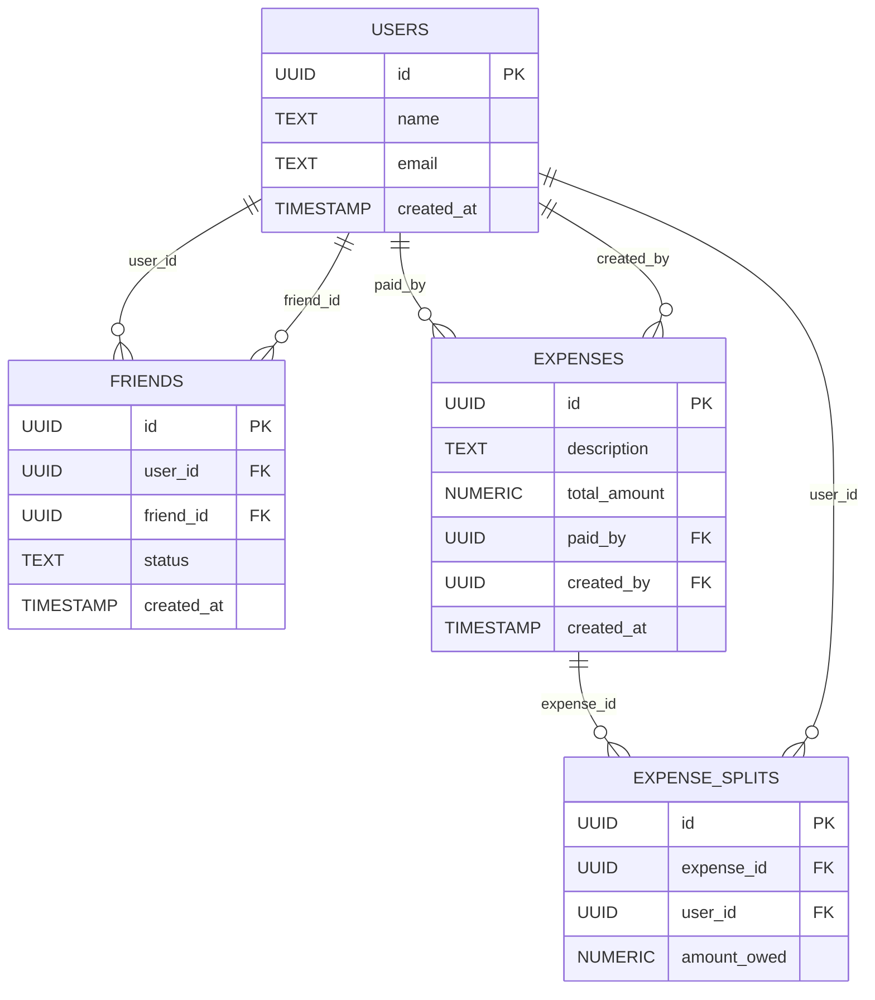

# bill-splitter
Here is a GitHub README-ready Mermaid ER diagram for the schema in your image:

```mermaid
erDiagram
    USERS {
        UUID id PK
        TEXT name
        TEXT email
        TIMESTAMP created_at
    }

    FRIENDS {
        UUID id PK
        UUID user_id FK
        UUID friend_id FK
        TEXT status
        TIMESTAMP created_at
    }

    EXPENSES {
        UUID id PK
        TEXT description
        NUMERIC total_amount
        UUID paid_by FK
        UUID created_by FK
        TIMESTAMP created_at
    }

    EXPENSE_SPLITS {
        UUID id PK
        UUID expense_id FK
        UUID user_id FK
        NUMERIC amount_owed
    }

    USERS ||--o{ FRIENDS : user_id
    USERS ||--o{ FRIENDS : friend_id

    USERS ||--o{ EXPENSES : paid_by
    USERS ||--o{ EXPENSES : created_by

    EXPENSES ||--o{ EXPENSE_SPLITS : expense_id
    USERS ||--o{ EXPENSE_SPLITS : user_id
```
