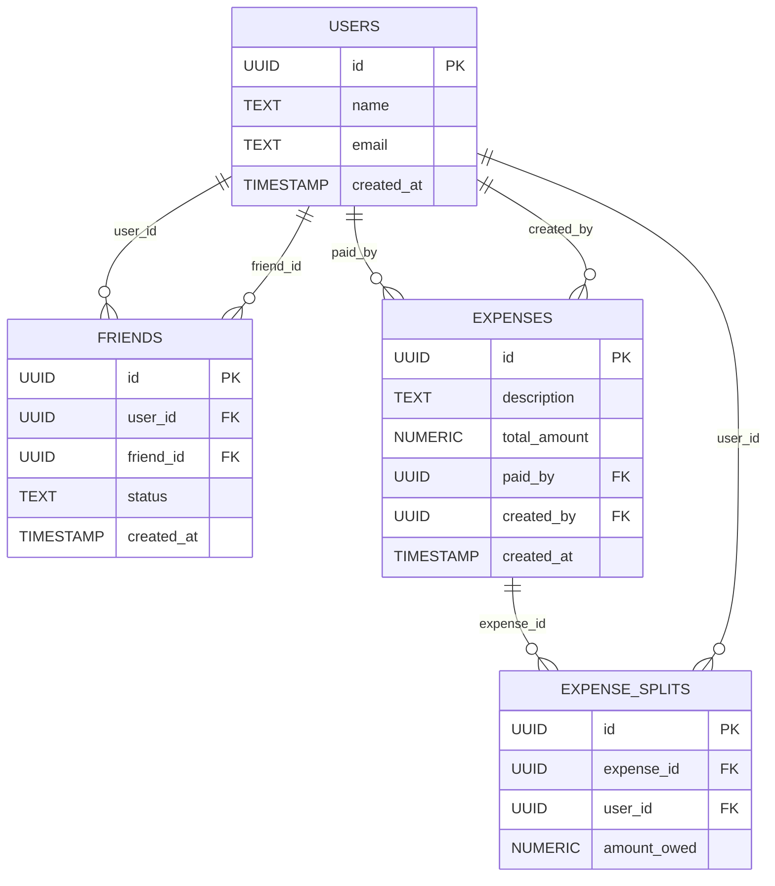
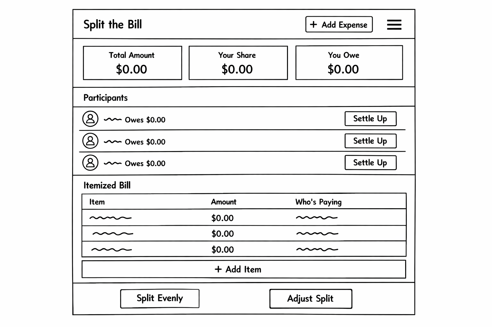

# 💸 Bill Splitter App

## 🚀 30-Second Elevator Pitch

A modern bill-splitting web application that makes it effortless for groups to track shared expenses, split costs fairly, and settle balances transparently. Built on the PERN stack (PostgreSQL, Express, React, Node.js), this app eliminates confusion around “who owes what” by providing real-time expense tracking, flexible splitting options, and clear balance summaries—perfect for roommates, trips, and group activities.

---

## 🎯 Core MVP Features

These are the essential features required to deliver a functional and valuable first version:

### 👤 User Management

* User registration and authentication (JWT-based)
* Basic user profile (name, email)

### 🤝 Friend System

* Add/remove friends
* Track friendship status (pending, accepted)

### 💰 Expense Tracking

* Create a new expense with:

  * Description
  * Total amount
  * Payer
* Associate expenses with multiple users

### ⚖️ Bill Splitting

* Equal split among participants
* Store per-user owed amounts
* Track who paid vs. who owes

### 📊 Balance Overview

* View total owed/owing per friend
* Simple summary: “You owe X” / “You are owed Y”

---

## 🌟 Stretch Goal Features

These features elevate the product beyond MVP and improve usability and differentiation:

### 🧠 Smart Splitting

* Unequal/custom splits
* Percentage-based splits
* Itemized splitting (per item in receipt)

### 📱 UX Enhancements

* Responsive mobile-first design
* Real-time updates (WebSockets or polling)
* Toast notifications for updates

### 🧾 Expense Management

* Edit/delete expenses
* Attach notes or receipts (image upload)
* Categorize expenses (food, rent, travel)

### 🏦 Settlements

* Mark debts as settled
* Settlement history tracking

### 👥 Group Functionality

* Create groups (e.g., “Trip to NYC”)
* Group-level expense tracking

### 🔐 Advanced Auth

* OAuth (Google login)
* Password reset flow

---

## 🗄️ Database Design

*The ER diagram for the database schema is shown below:*



---

## 🔌 Possible API Endpoints

### Auth

* `POST /api/auth/register` – Register a new user
* `POST /api/auth/login` – Authenticate user

### Users

* `GET /api/users/:id` – Get user profile
* `GET /api/users` – Get all users (for friend search)

### Friends

* `POST /api/friends` – Send friend request
* `GET /api/friends` – Get all friends
* `PATCH /api/friends/:id` – Update friend status
* `DELETE /api/friends/:id` – Remove friend

### Expenses

* `POST /api/expenses` – Create expense
* `GET /api/expenses` – Get all expenses for user
* `GET /api/expenses/:id` – Get single expense
* `DELETE /api/expenses/:id` – Delete expense

### Expense Splits

* `POST /api/expense-splits` – Create splits for expense
* `GET /api/expense-splits/:expense_id` – Get splits for an expense

### Balances

* `GET /api/balances` – Get user balance summary

---
## 🧩 Wireframes

*Initial wireframes for the application are included below:*

```
/wireframes/
  ├── home.png
  ├── dashboard.png
  ├── add-expense.png
  └── balances.png
```

---

## ⚙️ Installation & Setup

```bash
# Clone the repo
git clone https://github.com/your-username/your-repo-name.git

# Navigate into project
cd your-repo-name

# Install backend dependencies
cd server && npm install

# Install frontend dependencies
cd ../client && npm install

# Run development servers
npm run dev
```

---

## 🔮 Future Improvements

* Payment integrations (Venmo, PayPal)
* AI receipt scanning (OCR)
* Analytics dashboard (spending insights)

---

## 👤 Author

Liz Hoppstetter
GitHub: [https://github.com/lizhopp](https://github.com/lizhopp)

---


